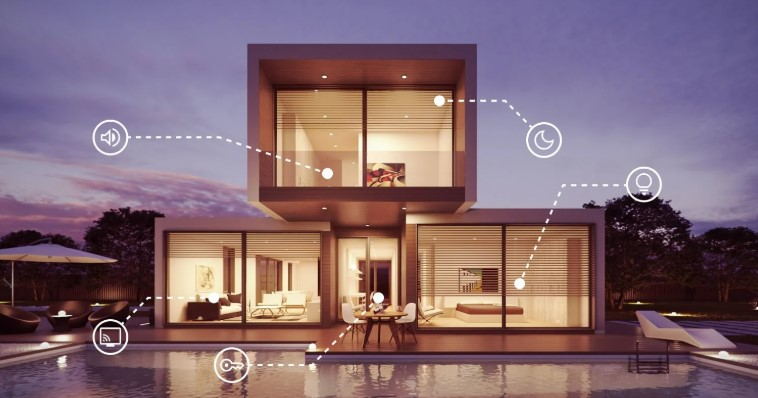

# 🏠 Smart Home




## 📌 Project Overview  
- The **Smart Home** project is a console-based application that simulates the behavior of various smart home devices. 
- Users can interact with these devices, turning them on/off, adjusting settings, and retrieving status updates.

## 🔥 Features  
✅ Turn smart devices on/off
✅ Manage settings for each smart device  
✅ Retrieve device statuses  


## 🏗️ Class Overview  

### **SmartHome (Base Class)**
- Abstract class for all smart home devices  
- Defines core functionalities for turning devices on/off and retrieving status updates

### **Smart Air Conditioner**
- Controls a smart air conditioning system  
- Features:  
  - Turn on/off smart air conditioner  
  - Set smart air conditioner temperature (10 - 30°C) 
  - Display smart air conditioner status  

### **Smart Alarm** 
- Controls a smart alarm system  
- Features:  
  - Turn on/off smart alarm  
  - Set smart alarm decibel level (80 - 120 dB)  
  - Display smart alarm status  

### **Smart Door Lock** 
- Controls a smart lock system  
- Features:  
  - Lock/unlock smart door
  - Set PIN code (6 - 15 characters)
  - Change PIN code
  - Display smart door lock status  

### **Smart Light**
- Controls smart light system
- Features:  
  - Turn on/off smart lights  
  - Adjust smart light brightness (1 - 100)
  - Display smart light status  

### **Smart Surveillance Cameras**
- Controls surveillance cameras system
- Features:  
  - Turn on/off smart surveillance cameras  
  - Set smart cameras resolutions: (`Low`, `Medium`, `High`)  
  - Display smart surveillance cameras status

### **Smart TV**
- Controls a smart TV system
- Features:  
  - Turn on/off smart TV  
  - Change smart TV channels (5 channels)
  - Display smart TV status  

### **Smart Water Heater**
- Controls a water heater system  
- Features:  
  - Turn on/off smart water heater  
  - Set smart water heater temperature (20 - 50°C)
  - Display smart water heater status  


## ⚙️ How to Run Smart Home Project:

1. Clone the repository:  
   ```sh
   
   git clone https://github.com/kimamovic21/smart-home.git
   
   ```
	
2. Open project with Microsoft Visual Studio 2022 IDE

3. Press the green button to compile and run the project